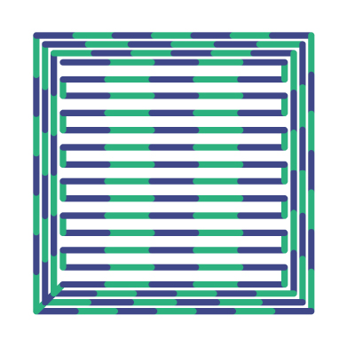
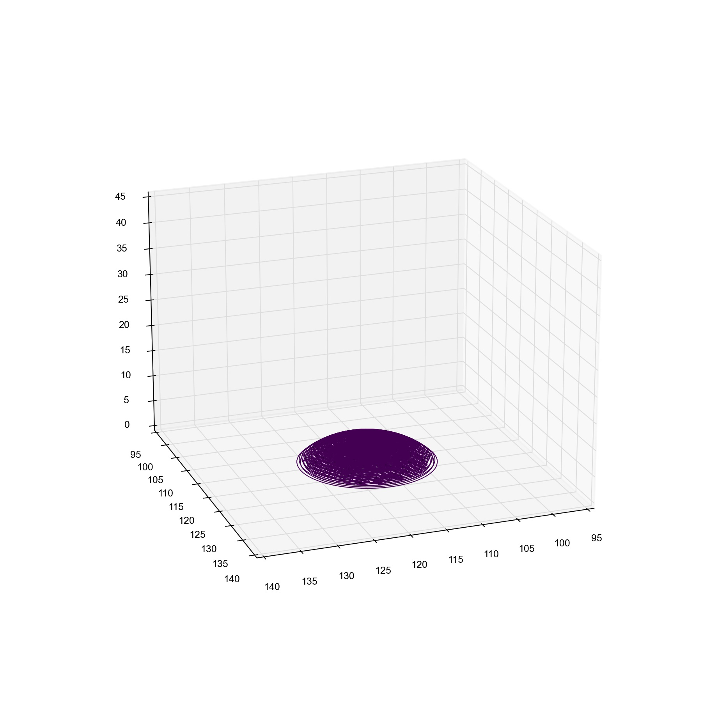
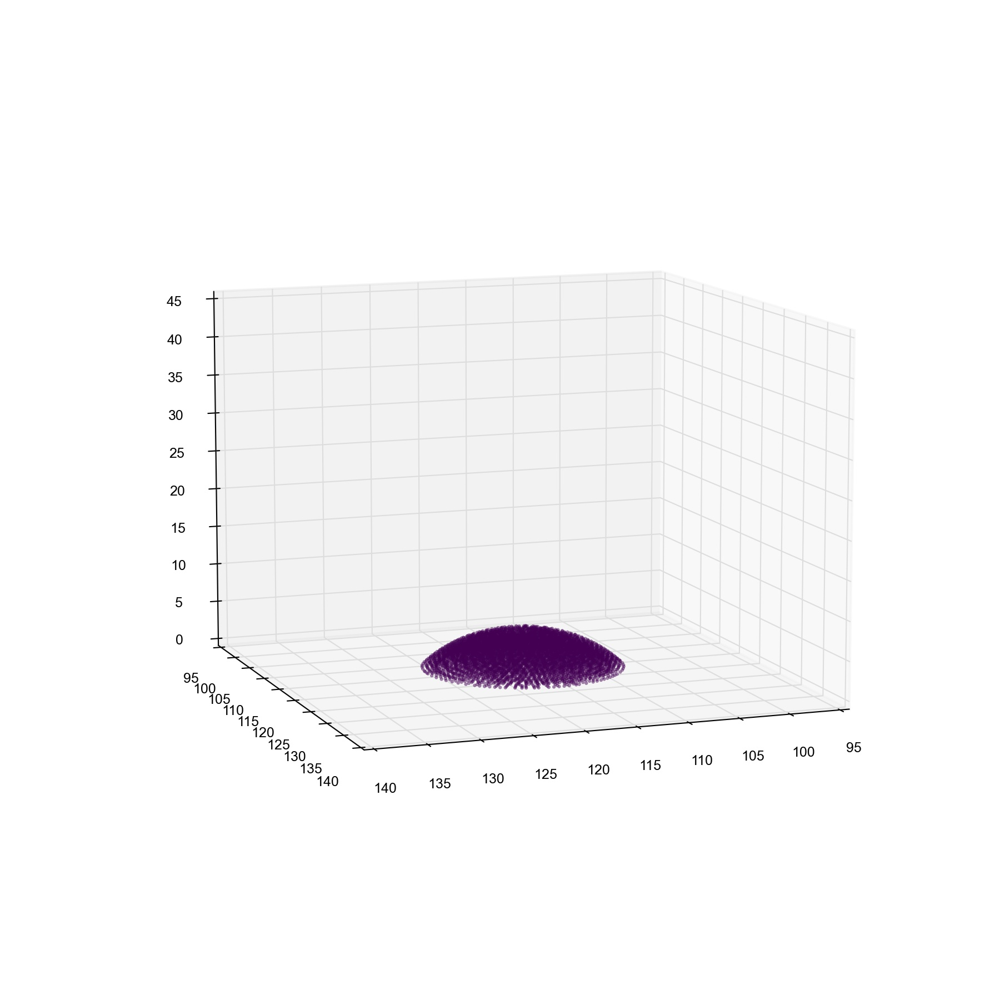
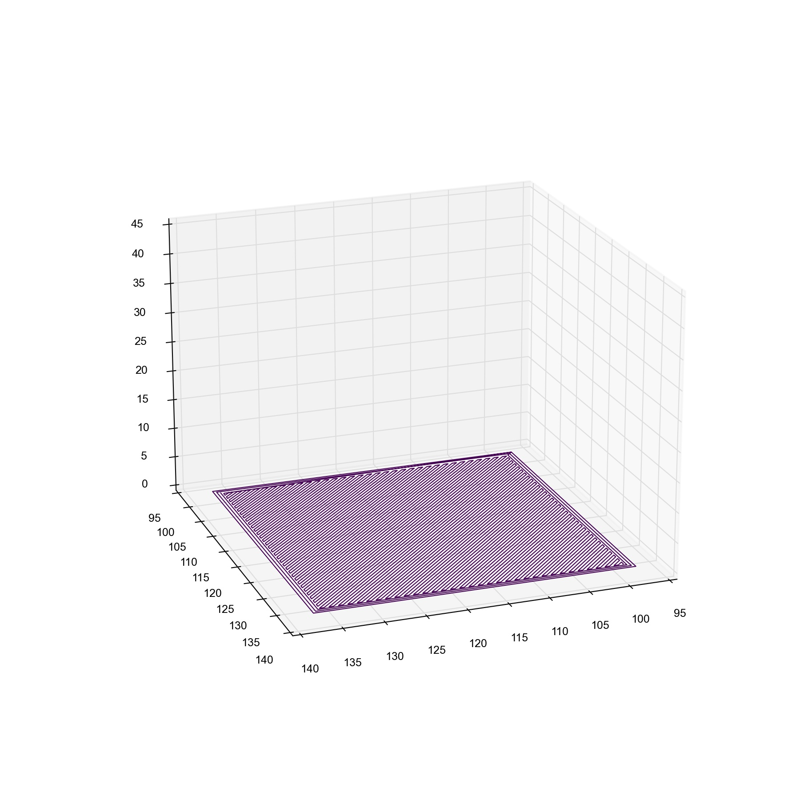
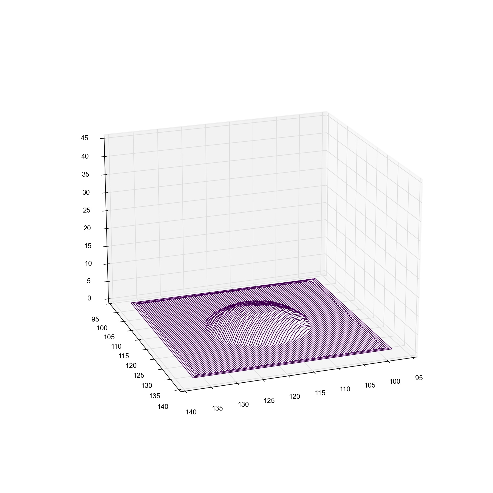
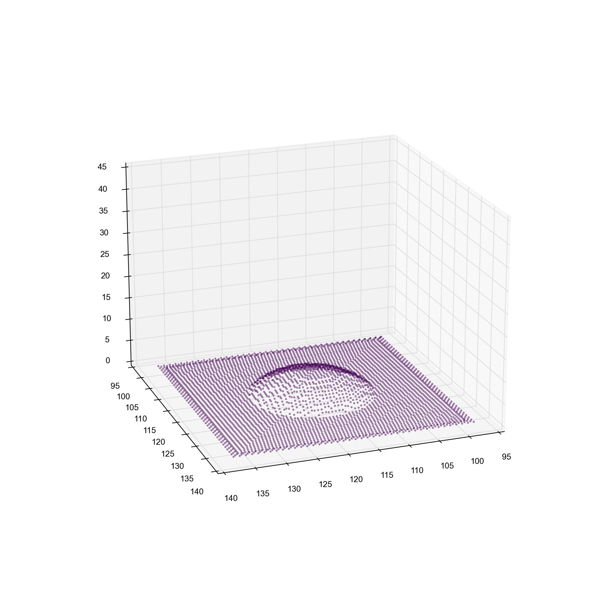

# Conformal-3D-Printing

Python based gcode parser and manipulator designed for generating conformal 3D printing toolpath. 

## About

The parser reads in gcode files and creates a gcode model object representing the 3D model to be printer. This is split into the individual layers and segments to allow for easy manipulation with Python 3. This repository contains various tools and utilies for manipulating and modified exisiting gcode files. We have built this tool to just use the in-built Python 3 libraries and tried to make it as fast and easier to use as possible.

- **Conformal printing:** use two gcode files and transform one to the surface of the other for conformal printing.
- **Line splitter:** cut up longer travel or extrude move commands into multiple shorter moves. This can be used for improving response times during online printing parameter correction.
- **Distance calculation:** accurate calculation of distance travelled by the printhead (both travel and extrude).
- **Extrude amount:** obtain accurate estimate for amount of material that will be extruded during a print.
- **Line filtering:** filter out unwanted lines of gcode through interaction with Python object, these could be comments, `MXXX` commands, travels etc.
- **Selective Z raises:** specify regions of the model to raise or lower Z values for. Useful for deforming existing gcode files to be printed on multi-level platforms.

## Usage

### Parser

It is very easy to parse and gcode file with a single include to your project.

```python
from parser import GcodeParser

parser = GcodeParser()
model = parser.parse_file("test/parser/hinge.gcode")
print(model)
```

Will get something like the following output:

```
<GcodeModel: len(segments)=109432, len(layers)=201, distance=217169.74678635265, extrudate=5875.699329999992, bbox=X: 0.0, 155.719; Y: 0.0 140.0; Z: 0.0 11.1;>
```

You can then save the parsed model to file with the inbuilt `write` method. This should always create the same output gcode as input; however, it will remove blank lines and trailing spaces. In practice you would never do this, but manipulate the gcode in someway first... examples of this can be seen below.

### Line splitter

Splitting gcode into smaller segments is useful to enable the rapid update of printing parameters when either collecting data using different combinations of printing settings, or when attempting real-time closed loop control of printing parameters. The splitter can easily be run as follows:

```bash
python src/line_splitter.py -f filepath/file.gcode -l 1.0
```

In this example the `file.gcode` is split into `1.0mm` sections and then saved as a new filed preprended by `split_`. Specify the path of the file to split with the `-f` argument and the length of the largest split section (in mm) with `-l`.

Example of input original gcode and split output into smaller segments.

<table>
<tr>
    <td>Original</td>
    <td>Split</td>
    </tr>
<tr>
<td></td>
<td>  </td>
</tr>
</table>

### Conformal printing

The default location for gcode files when using the conformal code is `test/conform/`.

The single Python file `conform.py` located in `src` can be used to map one gcode file onto the surface of another. Provide the path to the gcode file which you want to conform to the `-f` argument, and the path to the gcode for the surface to the `-s` argument. The argument `-l` is used to specify the maximum split length in mm and defaults to 1.0mm.

```bash
python src/conform.py -f test/conform/thingtobeconformallyprinted.gcode -s test/conform/surfacetoprinton.gcode -l 1.0
```

Multiple visualisations methods can be found in `visualise.py` in the `src` directory. With these you can see the various stages of the conforming process.

<table>
<tr>
<td>Line plot of gcode substrate</td>
<td>Scatter plot of gcode substrate</td>
<td>Extracted point cloud from substrate</td>
</tr>
<tr>
<td></td>
<td>  </td>
<td>  </td>
</tr>
<tr>
<td>Line plot of gcode to conform</td>
<td>Line plot of conformed gcode over substrate</td>
<td>Scatter plot of conformed gcode over substrate</td>
</tr>
<tr>
<td></td>
<td></td>
<td>  </td>
    </tr>
</table>

## ✍️ Authors <a name = "authors"></a>

- [Douglas Brion](https://github.com/dougbrion)
- [Zehao Ji] (https://github.com/Zehao-Ji)
